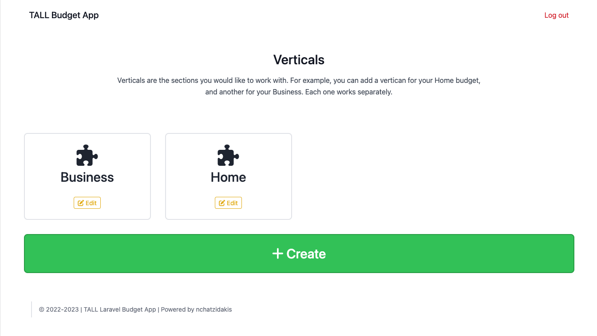
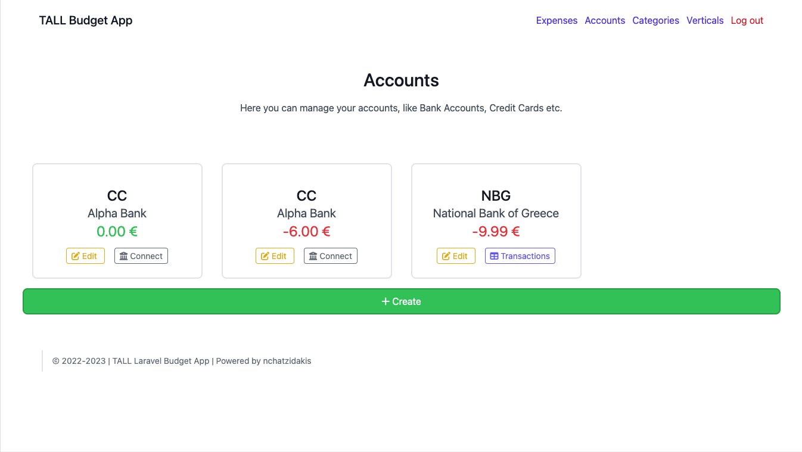
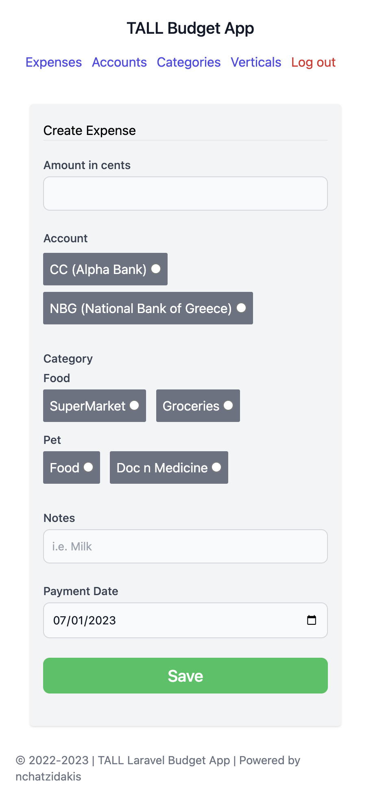

# TALL Budget App
This is a budget app that will be based on [TALL](https://tallstack.dev/). 

## Key concepts
- A user will be able to create a Vertical, i.e. home, business "ABC", so you will be able to manage both your business and personal financing.
- In each Vertical you will manage its:
  - Accounts (Bank accounts, Credit Cards etc.)
  - Expense Categories
  - Expenses
  - Incomes
  - Debt
  - Investments
  - Budget
- One user will be able to create or manage multiple Verticals, and each Vertical will be managed by one or more users.
- We will use [multi-tenancy](https://tenancyforlaravel.com/) in order to support multiple users in the same application.
- We will use Tenants as Verticals in codebase (we alias Tenants to Verticals in order to be understood by users easily)

## TODO
- Bills functionality - **Priority 1**
- Expenses UI improvements + CRUD - **Priority 2**
- Categories UI Improvements + CRUD - **Priority 2**
- Change create expense form ui
    - First select category then show subcategories
    - remove radios and add colors
- Add balances to Accounts, the logic and the service to do the calculations
- Connect with OpenBank API to sync transactions (for a specific account)
- Add transaction mapping
- Add alerts when updating DB **Priority 3**
- Accounts: show (probably list history of expenses and incomes) **Priority 3**
- Accounts: delete **Priority 5**
- Tenants: delete **Priority 5**
- Income Sources in a separate table **Priority 6**

## Screenshots

Supports both desktop and mobile

### Verticals dashboard

### Accounts dashboard

### Expense form in mobile

